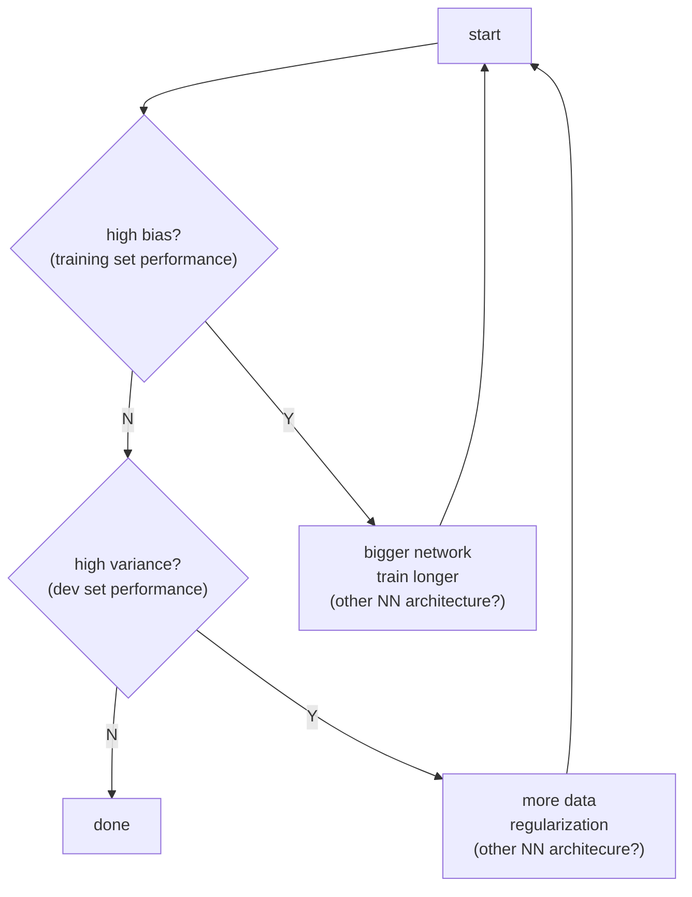

# Basic recipe for deep learning

The following flowchart in suggested by [[Andrew Ng]] in the [[Coursera specialization on deep learning]].

Thus, as long as we can make the network bigger and add more data, there is not [[bias-variance tradeoff]].