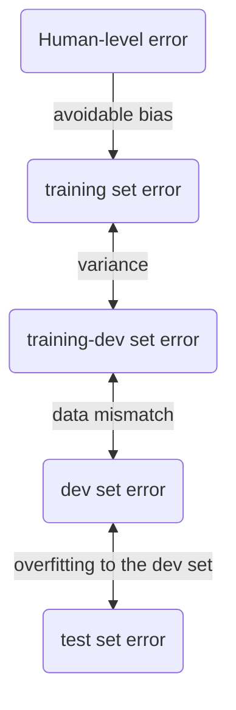

# Model selection

To select between different models for a given problem (e.g. the degree used in [[polynomial regression]]), on should not use the [[training set]] or the [[test set]]. If using the former, one does not obtain any information about generalization. If using the latter, the model is fitted to the test set, and one obtains less information about how the model generalizes to new data.

Thus one randomply splits the data into three subsets:
- the *[[training set]]*,
- the *[[cross-validation set]]* (also called *validation*, *cv* or *dev* set),
- and the *[[test set]]*.

The training set is used to train the different models. The cross-validation set is used to compare the different models using [[performance measure|performance measures]] and choose a model. Finally, the test set is used to gauge performance of the chosen model on new data.

One aid in model selection are [[learning curves]].

If limited data is available ($\le 10000$ training examples), a split of 60%/20%/20% (or 70%/30% if not separate test set is used) is recommended. If larger amounts of data are available, one typically selects a smaller percentage as cv and test sets.

It is important that the dev and test sets come from the same distribution of data, i.e. the one the model will be used for in applications. For deep learning, the training set may be augmented with data from a related, but different, source.

Specifically one has two options for augmenting data:
- Mix all data together, then split into training/dev/test sets. The advantage of this is that the three sets have the same distribution, but the disadvantage is that the dev and test sets do not have the distribution of data one cares about.
- A better option is to use most of the data one cares about for the dev/test sets and use the augmented data only in the training set (with possibly some of the original data mixed in).

To understand the [[bias]] and [[variance]] when having mismatched distributions, cut the training set into a training and a training-dev set, and only train on the former. Then one can compare the performance on the training, the training-dev and the dev set to see what amount of performance loss is due to the mismatched distributions.

See also [[tips for hyperparameter tuning]].