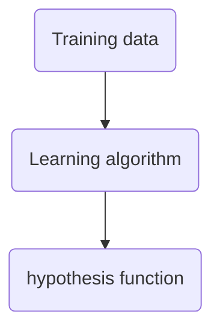

# Supervised Learning

The answer is given for all training examples, and the task is to produce the right answer for new examples.

The basic types of supervised learning are
- [[00 - regression problem|regression problems]]: predict a continuous value output
- [[00 - classification problem|classification problems]]: predict a discrete value output

The basic steps of a supervised learning algorith can be summarized as

The hypothesis function, usually denoted $h$, takes in an example $x$ and predicts the associated value $y = h(x)$.

Supervised learning algorithms are prone to [[bias]] and [[variance]].